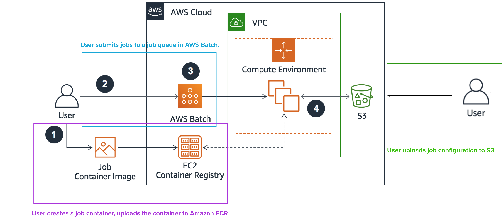

# future generation


# AWS Batch

## overview

- src/build_image_push_to_ecr.py builds the image and pushed it to ecr. Because this takes relatively long, instead of making a new images everytime I want to test different parameters or a different dataset, I make use of a seperate configuration file. 
- src/push_job_configuration_to_s3.py pushed a new job configuration to S3. This is much quicker the making a new image, and allows for quickly changing the parameters or dataset.
- src/submit_batch_job_to_queue.py submits a new job to the queue

See [AWS Batch-Based Architecture for more info](https://docs.aws.amazon.com/wellarchitected/latest/high-performance-computing-lens/batch-based-architecture.html)


## setup 

- install terraform (v0.14.5 is used for this project)
- make sure you have an AWS account
- I use [aws-vault](https://github.com/99designs/aws-vault) for handling the AWS credentials.

Note that you need to setup your MFA device in order to be able to create the IAM roles for the batch job.
e.g. in your .aws/config file there should be something like:

```
[profile <myprofile>]
mfa_serial = arn:aws:iam::<account-id>:mfa/<user>
region = <region>
```


# Docker

To build and run the container on your local machine:

`docker build -t future_generation .`
`aws-vault exec private -- docker run -it -e AWS_REGION -e AWS_ACCESS_KEY_ID -e AWS_SECRET_ACCESS_KEY -e AWS_SESSION_TOKEN -e AWS_SECURITY_TOKEN future_generation`


# resources

[Stochastic wavenet (2018). Guokun Lai, Bohan Li, Guoqing Zheng, Yiming Yang](https://arxiv.org/abs/1806.06116)
[Alexioannides script to build an image and push it to ecr ](https://github.com/AlexIoannides/py-docker-aws-example-project/blob/master/deploy_to_aws.py)